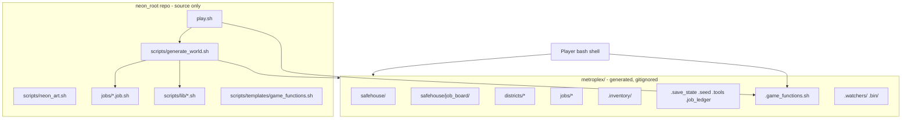
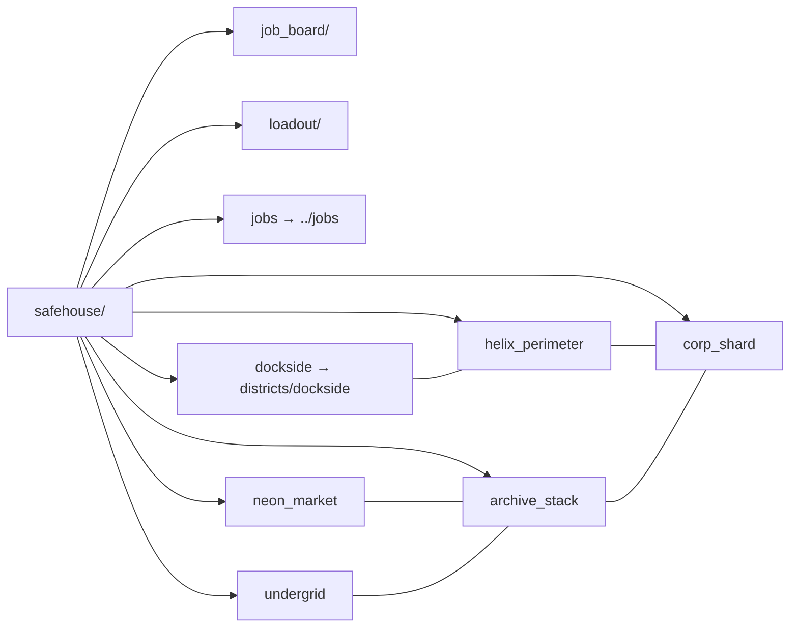
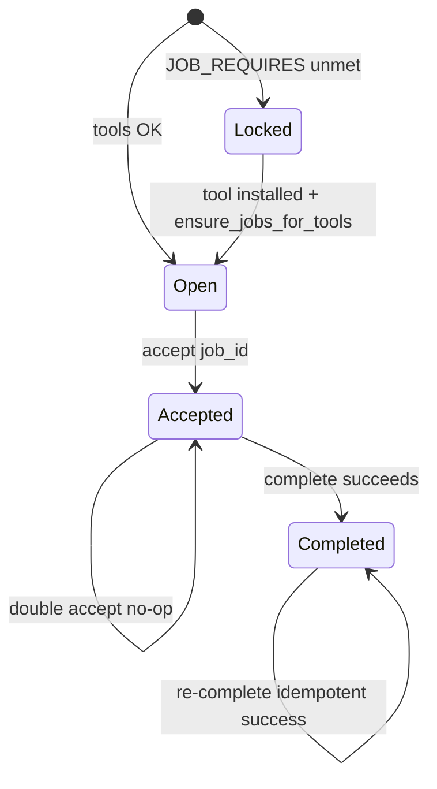
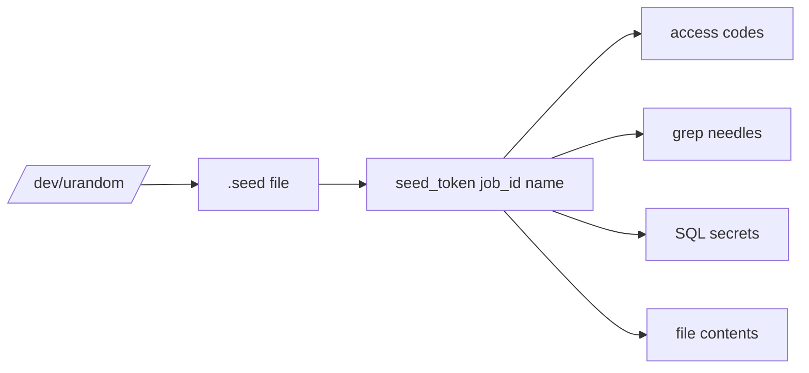

# Neon Root — Design Document

| Field | Value |
|-------|-------|
| **Title** | Neon Root: Cyberpunk Multi-Skill Filesystem Adventure |
| **Author** | TBD |
| **Date** | 2026-07-24 |
| **Status** | Draft (rev 2.1 — continue-path / operability polish) |
| **Sibling project** | The Ruins of Tuxville (`tuxville_game`) |
| **Repo path** | `/Users/peterf/Downloads/neon_root` |

---

## Overview

**Neon Root** is a text adventure played entirely in a real terminal. The game world is a generated directory tree representing a cyberpunk metroplex. Players solve jobs by using real tools — primarily the Linux/macOS shell, plus small Python scripts, Git, and optionally SQLite — rather than typing fictional adventure verbs.

Unlike its sibling **The Ruins of Tuxville** (a single linear dungeon), Neon Root uses a **hub-and-jobs** structure: a persistent Safehouse hub, a job board, and discrete mission directories that can be accepted, worked, and completed independently. Progress is filesystem state. Fiction defaults to **Street Netrunner** (freelance gridwork for hire), with the job board able to flavor individual contracts as Corp IT Mole or Open-Source Resistance work without changing the engine.

This document specifies architecture, safety model, v1 mission list (11 jobs: 10 core + 1 SQL stretch), district navigation, tool gating, relation to Tuxville, and an incremental PR plan suitable for a single developer building on Tuxville lessons.

---

## Background & Motivation

### Current state (Tuxville lessons)

Tuxville proved that “filesystem as world” is fun and educational:

| Pattern | How Tuxville does it | Neon Root stance |
|---------|----------------------|------------------|
| World = directory tree | `tuxville.sh` generates `tuxville/` | Generate `metroplex/` |
| Room descriptions | **Regular file** named `-` (not a directory); `look` does `cat "./-"` | Exact same convention |
| Helpers | Sourced `.game_functions.sh` (`look`, `take`, `hint`, `status`, `save`, `whereami`) | Same idea; expand for jobs |
| Progress | Inventory files under `.inventory/`; slain flag + pidfile for dragon; filesystem perms | Same + job ledger |
| Locks | `chmod 000` on directories | Same for shell jobs |
| Hostile process | One process: `tuxville/.bin/smaug_the_dragon`; root-level `.dragon_pid` / `.dragon_slain` | Multi-watcher: per-job names under `metroplex/.bin/`, pidfiles under `metroplex/.watchers/` |
| Inventory path safety | `take` is `mv "$1"` if regular file — **does not** reject `/` or `..` | **Hardening:** reject `/`, `..`, `.`, empty; refuse `-` and dotfiles |
| Launcher | `play.sh` → build/resume + `bash --rcfile` interactive shell; stable `.play_rc` (not mktemp+EXIT) | Same UX surface |
| Source-only repo | Generated `tuxville/` gitignored | Generated `metroplex/` gitignored |

Pain points of pure linear dungeons for multi-skill teaching:

1. **Skill variety** — One path cannot comfortably sequence shell, Python, Git, and SQL without feeling like a forced tour.
2. **Replay / spoiler resistance** — Fixed codes make walkthroughs permanent spoilers.
3. **Scope control** — A monolithic generator script (Tuxville’s ~1600-line `tuxville.sh`) becomes hard to extend per skill.
4. **Optional tools** — SQL/python/git should degrade gracefully; a linear dungeon cannot skip a mid-path heist cleanly.

### Why Neon Root (separate product)

Neon Root is a **new game**, not a Tuxville expansion. Coupling repos would force shared versioning, conflicting world roots, and theme collisions. Code reuse philosophy: **copy patterns and small pure helpers; never import across repos**.

---

## Goals & Non-Goals

### Goals (v1)

1. Ship a playable hub + **11 jobs (10 core + 1 SQL stretch)** covering shell (core), Python, Git, and optionally SQL.
2. One-command launcher (`./play.sh`) on macOS and Linux bash (including macOS bash 3.2).
3. Randomize secrets/codes per new game so public walkthroughs cannot fully spoil.
4. Detect `python3`, `git`, `sqlite3`; degrade via a single lock/install policy (see Key Decision 16).
5. Educational sandbox: no real network attacks, no privilege escalation against the host, no exfiltration outside the game tree (honor-system shell boundary documented).
6. Street Netrunner fantasy as default spine; job briefs can flavor mole/resistance contracts.
7. Incremental PR plan so each merge leaves the tree playable or clearly staged as scaffold.

### Non-Goals (v1)

- Full Docker / Kubernetes curriculum.
- Networked multiplayer or real remote hosts.
- GUI, web frontend, or packaged installers.
- Full Python packaging / virtualenv pedagogy (scripts stay single-file, stdlib only).
- Windows / PowerShell support.
- Coupling to the Tuxville git history or shared library package.
- Comprehensive story campaign with cutscenes; jobs are short contracts.
- Real cryptography challenges beyond toy hashes/simple XOR.
- OS-level confinement of the player shell (no Docker, no chroot requirement).

---

## Fantasy Spine (Default + Variants)

### Default: Street Netrunner

You are a freerunner for hire in **Metroplex**. The city OS is hostile; districts are permission domains. A fixer posts contracts on a board in the Safehouse. You navigate the grid (`cd`/`ls`), bypass locks (`chmod`), kill watchers (`ps`/`kill`), write implant scripts (`python3`), recover burned safehouse history (`git`), and (stretch) query a corp payroll shard (`sqlite3`).

**Why default for v1:** Neon flavor matches cyberpunk expectations; process-kill and firewall metaphors map cleanly onto shell skills; the job-board fiction naturally absorbs mole and resistance contracts as “gigs.”

### Job-board flavoring (no engine fork)

Each job has a brief with:

- `spine`: `netrunner` | `mole` | `resistance` (display only)
- Title, client alias, payout fiction, objective text

**Illustrative briefs only (not v1 job ids).** The v1 Mission List is authoritative for real `JOB_ID`s. These rows show how the same engine can flavor prose:

| Illustrative label | Spine flavor | Example player-facing line |
|--------------------|--------------|----------------------------|
| *(netrunner gig)* | netrunner | “Scrub Sector-7 camera log before ICE arrives” |
| *(mole ticket)* | mole | “Ticket INC-4412: rotate staging cert before pager fires” |
| *(resistance drop)* | resistance | “Exfil open-spec docs locked behind Helix ACLs” |

Real v1 examples: `kill_watcher` / `badge_skim` (netrunner), `perm_gate` / `git_stash_drop` (mole), `archive_drop` / `git_safehouse` (resistance).

Same mechanics; different prose. Hub room text stays Netrunner.

---

## Proposed Design

### High-level architecture



### Directory layout (repo + generated world)

```text
neon_root/                          # git tracked
  play.sh                           # launcher
  README.md                         # min reqs: bash; optional: python3, git, sqlite3
  .gitignore                        # metroplex/, etc.
  bin/                              # optional host-side wrappers (empty v1)
  docs/
    DESIGN.md
    FANTASY_NOTES.md
  scripts/
    generate_world.sh
    neon_art.sh
    detect_tools.sh
    smoke_test.sh                   # lands early after tutorial (see PR plan)
    lib/
      common.sh
      seed.sh
      job_runtime.sh                # generator + helper shared concepts
      watchers.sh                   # spawn_watcher / kill_all_watchers
    templates/
      game_functions.sh
  jobs/
    00_tutorial_grid.job.sh
    01_badge_skim.job.sh
    ...
    10_payroll_shard.job.sh         # stretch; may ship later

metroplex/                          # generated at play time, gitignored
  .game_functions.sh                # OVERWRITTEN on every continue (do not edit)
  .inventory/
  .save_state
  .seed                             # opaque seed for this save (immutable)
  .tools                            # rewritten every launch by detect_tools
  .job_ledger                       # AUTHORITATIVE job state
  .generate.log                     # last build summary (truncated / overwrite each gen)
  .bin/                             # watcher executables: nr_watcher_<job_id>
  .watchers/                        # <job_id>.pid , <job_id>.down
  safehouse/
    -                               # FILE (room description), not a directory
    .hint
    job_board/
      -                             # FILE
      open/                         # one plain-text file per job id (not symlinks)
      active/
      completed/
      locked/                       # missing-tool jobs still listed for visibility
    loadout/
    dockside -> ../districts/dockside          # symlink edges (see Navigation)
    neon_market -> ../districts/neon_market
    helix_perimeter -> ../districts/helix_perimeter
    archive_stack -> ../districts/archive_stack
    undergrid -> ../districts/undergrid
    corp_shard -> ../districts/corp_shard      # always present; district lore even if SQL locked
    jobs -> ../jobs                            # symlink so look shows "jobs" exit from hub
  districts/
    dockside/
      -                             # FILE
      .hint
      # lore rooms + optional symlink into a job workspace when useful
    neon_market/
    helix_perimeter/
    archive_stack/
    undergrid/
    corp_shard/
  jobs/                             # PLAYABLE WORKSPACE ROOT for every job
    <job_id>/
      -                             # FILE room description
      .hint
      .job_meta                     # id, skill, spine, requires, WORK_ROOT, title
      .objective                    # player brief text
      .check_complete               # executable checker (only completion API)
      ... puzzle content ...
```

**Room description convention (mandatory):** The room description is a **regular file** named `-` (hyphen), exactly as in Tuxville. It is **not** a directory. `look` runs `cat "./-"` when that file exists. Authors must never `mkdir -`.

### Navigation model (filesystem edges)

**Decision: Hub symlink mesh + job dirs as sole workspaces.**

Tuxville works because the world is one nested path. Neon Root is a hub graph; edges must be real directory entries so `look` (which lists `*/` like Tuxville) discovers them.



**Rules:**

1. From `safehouse/`, exits are real children: `job_board/`, `loadout/`, district **symlinks**, and `jobs` symlink.
2. District-to-district edges are **relative symlinks** inside `districts/` matching the map (e.g. `districts/dockside/helix_perimeter` → `../helix_perimeter`). Safehouse is always reachable via `cd` up or a `safehouse` → `../../safehouse` symlink in each district.
3. `look` discovers exits exactly like Tuxville: any subdirectory (including symlink-to-dir) under `*/`. Authors must create dirents; prose-only “exits” are invalid.
4. **Playable puzzle content lives only under `metroplex/jobs/<job_id>/`** (sole workspace). Districts are navigable lore rooms. A district may contain a symlink such as `active_contract` → `../../jobs/<job_id>` when fiction wants a “staging terminal,” but the job’s `.check_complete`, data files, git repos, and locks are authored under `jobs/<job_id>/`.
5. `.job_meta` always contains `WORK_ROOT=jobs/<job_id>` (relative to metroplex). `accept` prints the absolute path and suggests `cd`.
6. `metroplex/jobs/` is both package root and the playable room graph for contracts; players typically `cd jobs/<id>` after accept (via hub `jobs` symlink or absolute path from brief).

### Tool degradation policy (single source of truth)

**Every launch** re-runs `detect_tools.sh` and rewrites `metroplex/.tools`.

| Case | Board | Content on disk | Later tool becomes available |
|------|-------|-----------------|------------------------------|
| Job requires `python3` or `git`; tool **missing** at install | File under `job_board/locked/<id>` with reason line | **Full `job_install` still runs** (content present) | Re-detect flips board entry Locked→Open; **no seed rewrite**; ledger unchanged |
| Job requires `sqlite3`; tool missing | Same as above: **Locked + content installed** if job file is shipped | Full install | Same unlock path |
| Job file **not shipped** in repo (e.g. SQL PR not merged) | **Omitted** entirely | Not installed | On continue after pull: `ensure_jobs_for_tools` discovers new plugin → install content + **create board file** (open or locked); no `--new` required |
| Shell jobs | Always Open (after tutorial soft-gate rules) | Installed | N/A |

**Rationale:** Installing content while Locked avoids a reinstall path that could desync seed-derived secrets. Players see what to install (`jobs` shows Locked + missing tool). Omit only means “not in this build.”

**Continue path algorithm:**

1. Detect tools → write `.tools`.
2. Refresh `.game_functions.sh` from template (Tuxville-identical policy: **do not edit helpers in the world**; overwrites are intentional).
3. Run `ensure_jobs_for_tools` (full algorithm below). Track whether any job was newly board-created or unlocked this session (`NEON_SESSION_UNLOCKS` count) for `status` messaging.
4. Respawn watchers per watcher policy (below).
5. Never regenerate seed; never wipe ledger/inventory.

#### `ensure_jobs_for_tools` (full algorithm)

Runs on every continue (and may be invoked from `--new` job loop as the shared “place board” helper). Uses **existing** `.seed` only — never rewrites seed or ledger rows except by not touching them.

For each shipped plugin in sorted `jobs/*.job.sh` order:

```text
ensure_jobs_for_tools(ROOT):
  source common.sh, seed.sh, watchers.sh   # same prereqs as generate
  load SEED from ROOT/.seed (strip whitespace)
  detect already done → .tools is current

  for each plugin file in sorted jobs/*.job.sh:
    unset JOB_* and job_install
    source plugin (must not assume repo-relative cwd; use paths relative to ROOT only)
    validate JOB_ID =~ ^[a-z0-9_]+$
    require job_install function

    # 1) Content
    if [[ ! -d "$ROOT/jobs/$JOB_ID" ]]; then
      job_install "$ROOT"          # existing seed → baked secrets stable for this save
      log ENSURE_INSTALL $JOB_ID
    fi

    # 2) Board file existence (critical for new plugins on old saves)
    board_path = find file named $JOB_ID under
                 job_board/{open,active,completed,locked}/
    if no board_path:
      # Prefer ledger if player somehow completed/accepted without board (desync)
      if ledger state == completed:
        write_board_file completed/ $JOB_ID   # meta from JOB_*; REASON empty
      else if ledger state == accepted:
        write_board_file active/ $JOB_ID
      else if tools_satisfy(JOB_REQUIRES):
        write_board_file open/ $JOB_ID
        session_unlocks++
      else:
        write_board_file locked/ $JOB_ID with REASON=missing <tool>
        session_unlocks++   # newly visible Locked still counts as “new contract seen”
      log ENSURE_BOARD $JOB_ID <bucket>
      continue to next plugin

    # 3) Unlock locked → open when tools appear (not if completed/accepted)
    if board in locked/ AND tools_satisfy(JOB_REQUIRES)
       AND ledger is not completed AND ledger is not accepted:
      move locked/$JOB_ID → open/$JOB_ID
      clear REASON=
      session_unlocks++
      log ENSURE_UNLOCK $JOB_ID

    # 4) Never: re-seed; move completed → open; invent ledger rows from board
    # 5) Optional: if ledger accepted but board in open/locked, board_sync will fix
```

`write_board_file` uses the same plain-text format as `--new` (TITLE, SKILL, SPINE, REQUIRES, WORK, REASON).

After the loop, callers may set a session flag file `ROOT/.session_unlocks` with the count (optional; helpers can also recompute).

### Hub-and-jobs lifecycle



There is **no Failed state in v1**. Abandon is out of scope (v1.1). Corrupt ledger recovery = `./play.sh --new` only.

#### Authoritative state

| Store | Role |
|-------|------|
| `.job_ledger` | **Authoritative** FSM: `open` is implicit (no row); rows are `accepted` or `completed` |
| `job_board/{open,active,completed,locked}/` | **Derived view** rewritten by `accept`/`complete`/generator/`ensure_jobs_for_tools`/`board_sync_from_ledger` |
| If desync | Prefer ledger; run `board_sync_from_ledger` (never invent ledger rows from stray board files) |

#### `board_sync_from_ledger` (full algorithm)

**When to call:** at the start of every player-facing `jobs`, `status`, `accept`, and `complete` (cheap: few files). Also once at end of `ensure_jobs_for_tools` on continue so the first `look`/`jobs` is consistent.

**Inputs:** `.job_ledger`, `.tools`, shipped job meta (from `jobs/<id>/.job_meta` or plugin list), existing board files (for TITLE/REASON salvage).

**Rules:**

1. **Do not invent ledger rows** from board files that have no ledger entry and no shipped plugin.
2. **Shipped jobs only** appear on the board (unknown board files for removed plugins may be left alone or deleted; v1: delete orphans not in shipped set).
3. For each shipped `JOB_ID`:
   - If ledger `completed` → ensure exactly one board file in `completed/`; remove from open/active/locked.
   - Else if ledger `accepted` → ensure file in `active/`; remove from open/completed/locked. (Accepted jobs stay active even if tools later missing — player is mid-contract.)
   - Else (no ledger row = implicit open candidate):
     - If tools satisfy `JOB_REQUIRES` → file in `open/` (REASON empty).
     - Else → file in `locked/` with `REASON=missing <tool>` (preserve existing REASON text if already correct).
4. **Locked is board-only** — ledger has no `locked` state; tools gate never writes ledger.
5. Preserve TITLE/SKILL/SPINE/WORK from existing board or `.job_meta` when moving buckets.
6. After sync, at most one board file per `JOB_ID` across all four buckets.

```text
board_sync_from_ledger(ROOT):
  shipped = set of JOB_IDs from jobs/*/.job_meta (or plugin scan)
  for id in shipped:
    state = ledger_state(id)   # completed | accepted | none
    meta  = load_meta(id)
    body  = existing board body or render from meta
    remove all board copies of id from open|active|completed|locked
    if state == completed:
      write completed/id <- body (REASON=)
    else if state == accepted:
      write active/id <- body (REASON=)
    else if tools_ok(meta.REQUIRES):
      write open/id <- body (REASON=)
    else:
      write locked/id <- body (REASON=missing ...)
  delete board files whose id not in shipped   # v1 orphan cleanup
```

Ledger format (bash 3.2 friendly, pipe-separated):

```text
# id|state|accepted_at|completed_at
# JOB_ID must be snake_case [a-z0-9_]+ — never contains |
tutorial_grid|completed|2026-07-24T10:00:00|2026-07-24T10:12:00
badge_skim|accepted|2026-07-24T10:20:00|
```

Timestamps: `date -u +%Y-%m-%dT%H:%M:%S` (UTC, no fractional seconds).

#### Board file format (concrete — not symlinks)

Each board slot is a **plain text file** named exactly `JOB_ID` (e.g. `safehouse/job_board/open/badge_skim`):

```text
TITLE=Lift the Dock Badge
SKILL=shell
SPINE=netrunner
REQUIRES=
WORK=jobs/badge_skim
REASON=
```

Locked entries set `REASON=missing python3` (or similar). `accept` moves file `open/` → `active/`; `complete` moves `active/` → `completed/`.

#### Accept / complete decision table

| Situation | Behavior |
|-----------|----------|
| `accept <id>` when Open | Append/update ledger `accepted`; move board open→active; print `WORK` path; spawn watcher if job defines one and not already down |
| `accept <id>` when already Accepted | **No-op success**; print “Already on the clock: …” + path |
| `accept <id>` when Completed | Error: “Contract already closed.” |
| `accept <id>` when Locked | Error: print tool install hint from `REASON` / `.tools` |
| `accept <id>` unknown | Error: “No such job.” |
| `accept` non-tutorial while tutorial incomplete | **Soft gate:** print strong nudge, **still allow** accept (free exploration). See Key Decision 17 |
| Multiple concurrent Accepted | **Allowed**, no cap in v1. Each job’s watcher is independent |
| `complete` with no args | Resolve job: if `$PWD` is under `jobs/<id>` (or equals it), use that id; else if exactly one Accepted job, use it; else error “complete \<job_id\>” |
| `complete <id>` | Resolve `metroplex/jobs/<id>`; run checker regardless of cwd |
| `complete` without prior accept but checker would pass | **Reject:** “Accept the contract before cashing out.” (forces ledger discipline) |
| `complete` when Accepted and checker exits 0 | Ledger → completed; board active→completed; print payout flavor; do not respawn that watcher |
| `complete` when checker exits 1 | Print first line of checker stdout as hint; leave Accepted |
| `complete` when checker exits 2 | Print “Job misconfigured; report bug”; leave Accepted |
| `complete` when already Completed | **Idempotent success:** “Already paid out.” |
| `complete` when Locked / never open | Error |

#### Tutorial / soft gating

- `tutorial_grid` is **not** hard-blocked for others.
- Until `tutorial_grid` is `completed` in the ledger, `accept` on any other job prints a **nudge** (still succeeds).
- Board shows all tool-eligible jobs as Open (and tool-missing as Locked) from the start — **not** “Jobs 1–6 open only after tutorial.”
- Fiction still presents tutorial as “first jack-in.”

### Watcher / process lifecycle (multi-watcher)

Generalizes Tuxville’s single dragon without copying its single-pid layout literally.

**Paths:**

| Artifact | Path |
|----------|------|
| Executable | `metroplex/.bin/nr_watcher_<job_id>` |
| Pidfile | `metroplex/.watchers/<job_id>.pid` |
| Down flag (slain) | `metroplex/.watchers/<job_id>.down` |

**Process basename** must be exactly `nr_watcher_<job_id>` so `ps` teaching and `pkill -x` are precise. Host processes with colliding names are a residual risk (document; keep names unique and prefixed `nr_watcher_`).

**API (`scripts/lib/watchers.sh`, also usable at gen time):**

```bash
spawn_watcher "$job_id"     # no-op if .down exists or already running
kill_watcher "$job_id"      # TERM then KILL via pidfile; does not write .down
kill_all_watchers           # all pidfiles + pkill -x only nr_watcher_* known from .bin
```

Watcher script pattern (Tuxville dragon-like):

- Env: `NEON_WATCHER_DOWN`, `NEON_WATCHER_PIDFILE`
- `trap` on TERM/INT writes down flag, removes pidfile, exits
- Ignore HUP; sleep loop with `wait` so TERM hits the shell

**When to spawn:**

| Event | Behavior |
|-------|----------|
| `job_install` | May install the binary; **does not** start process (avoids orphans before play) |
| `accept` for a kill-type job | `spawn_watcher` if not `.down` and not running |
| `./play.sh` continue | For each ledger `accepted` (not completed) job that declares a watcher: respawn if not `.down` and not running (**same pedagogy as Tuxville respawning the dragon**) |
| Checker success on kill job | Expects `.down` or dead process per job design; completion leaves `.down` permanent |
| Shell `exit` | **Do not** kill watchers (Tuxville-compatible; orphans expected until next launch/`--new`) |
| `./play.sh --new` | `kill_all_watchers` then wipe `metroplex/` |

**Cap:** At most **one process per job_id**; v1 has ≤3 kill-type jobs ⇒ ≤3 concurrent watchers. Enforcement = unique pidfile per id, not a global counter.

**Player pedagogy (author rules):** Room text and hints name the exact process (`nr_watcher_kill_watcher`). Prefer `ps` + `kill <pid>`. Never suggest `kill -9 -1`, `pkill python`, or broad patterns. Generator `--new` may use `pkill -x nr_watcher_<id>` only for known ids.

### Skills: authoring and sandboxing

#### Shell (core)

- Pure filesystem puzzles under `jobs/<id>/`: logs, `chmod` locks, `find`/`grep`, dash-leading names, archives, pipes.
- All required paths under `metroplex/`.
- Process puzzles use watcher API above.

#### Python (small scripts)

- Job ships data + stub script; success = stdout/file matches **gen-time baked token**.
- Stdlib only; no `pip`.
- v1 does **not** wrap `python3` to block sockets (Open Question 4 closed as “docs + checklist only”).
- Puzzles never require network.

#### Git

- `git init` only under `metroplex/jobs/<id>/` (or a subdir thereof).
- Always local identity: `git -c user.email=runner@neon.local -c user.name='Neon Root' ...`
- **Never** `git config --global`.
- Remotes: none, or `file://` / relative path **inside** metroplex only.
- Completion never requires network push/fetch.

#### SQL (stretch)

- Local `payroll.db` under job dir; `sqlite3` CLI.
- Missing tool → Locked board + content still installed (policy above).
- Educational note: players can `ATTACH` other DBs; honor-system; puzzles never require it.

#### Honor-system shell boundary

The game **cannot** confine the shell without an OS sandbox. Players can `cd $HOME` or run anything. v1 accepts:

- No helper ever `cd`s outside metroplex or suggests host-destructive commands.
- README ethics + Author Safety Checklist.
- Completion only checks in-tree predicates.

### Completion checker contract

**Only** `.check_complete` (remove `.complete_when` from the design). Layout and API use this name exclusively.

| Property | Contract |
|----------|----------|
| Path | `metroplex/jobs/<job_id>/.check_complete` |
| Shebang | `#!/bin/bash` (or run via `bash .check_complete`) |
| Invoked by | `complete` helper: `( cd "$WORK_ABS" && bash .check_complete )` |
| cwd | **Always** `jobs/<job_id>` |
| Env | `NEON_ROOT` = absolute metroplex path; `JOB_ID` = id; `NEON_SEED_FILE` = `$NEON_ROOT/.seed` (optional; checkers should not need it) |
| Expected secrets | **Baked as string constants at `job_install` time** via `seed_token` during generation — do **not** recompute at runtime (avoids shipping `seed.sh` into the world) |
| Exit 0 | Success |
| Exit 1 | Incomplete; **first line of stdout** is player-facing next-step hint |
| Exit 2 | Misconfigured job (missing files); player-facing error |
| stderr | Dev diagnostics only if `NEON_ROOT_DEBUG=1` |
| Mutation | Checkers **may** read freely; **should not** mutate puzzle state except optional touch of a `.verified` marker; never rewrite ledger (helper does that) |
| May not | `eval` player code; call network; source player scripts |

### Randomization of codes



**`scripts/lib/seed.sh`:**

1. On `--new`, write 32 bytes hex to `.seed` (no trailing issues: always write without newline or strip on read with `tr -d ' \n\r'`).
2. `seed_token(job_id, name, [len])`:
   - Portable hash: `printf '%s' "$seed:$job_id:$name" | (shasum -a 256 2>/dev/null || sha256sum) | awk '{print $1}'`
   - Default `len=8` for short fiction codes; use 12–16 for higher-entropy file tokens.
3. Embed tokens into content at install time; bake the same strings into `.check_complete`.
4. Continue never regenerates seed-derived content.

### Tool detection UX

`scripts/detect_tools.sh` writes `metroplex/.tools`:

```bash
HAS_PYTHON3=1
HAS_GIT=1
HAS_SQLITE3=0
PYTHON3_BIN=/usr/bin/python3
GIT_BIN=/usr/bin/git
SQLITE3_BIN=
```

Minimum ship bar: **shell-only path completable** without python/git/sqlite (tutorial + shell jobs 1–6).

#### Sample `jobs` output

```text
  JOB BOARD — Metroplex Fixer Net
  ────────────────────────────────────────────
  OPEN
    tutorial_grid   Jack Into the Grid          [shell]
    badge_skim      Lift the Dock Badge         [shell]
  ACTIVE
    perm_gate       Crack the Perimeter Gate    [shell]
  LOCKED
    implant_parse   Compile the Implant         [python]  need: python3
    git_safehouse   Restore the Burned Vault    [git]     need: git
    payroll_shard   Query the Payroll Shard     [sql]     need: sqlite3
  COMPLETED
    (none)
  ────────────────────────────────────────────
  Tools: python3:no  git:yes  sqlite3:no
```

Locked jobs are **always visible** when shipped so players learn what to install. Omitted jobs (not in repo) do not appear.

### Launcher UX (`play.sh`)

```text
./play.sh              # continue if metroplex/ exists, else new
./play.sh --new        # kill_all_watchers; wipe metroplex/; re-seed; rebuild
./play.sh --continue   # resume only; error if missing
./play.sh --help
./play.sh --tools      # detect and print; exit (uses or writes temp if no world)
```

Flow:

1. `cd` repo root.
2. **Always** run detect (update `.tools` if world exists).
3. generate with mode; on continue: refresh helpers + `ensure_jobs_for_tools` + respawn watchers.
4. Resolve `START_ROOM` from `.save_state` (default `safehouse`).
5. Write `metroplex/.play_rc`; `exec bash --rcfile ... -i`.
6. PS1 like `neon:\W$ `; auto `look`.

macOS bash 3.2: no associative arrays in helpers; no `mapfile` required; avoid relying on `((done++))` status in conditionals (use `done=$((done+1))`).

### Player helpers (inventory rules)

| Command | Purpose |
|---------|---------|
| `look` | Cat `./-` if file; list subdir exits; list non-hidden regular files as items (exclude `-`) |
| `hint` | Cat `.hint` if present |
| `inventory` / `take` / `drop` | Global inventory under `metroplex/.inventory` |
| `whereami` / `save` | Bookmark room relative to metroplex |
| `status` | Victory progress, per-skill counts, tools, active jobs |
| `jobs` | Board view (see sample) |
| `brief [job_id]` | Show `.objective` |
| `accept <job_id>` | See decision table |
| `complete [job_id]` | See decision table |

**`take` / `drop` rules (land with inventory helpers — not deferred):**

1. Reject empty, `.`, `..`.
2. Reject if argument contains `/` or `\` (basename only; no path traversal).
3. `take`: source must be a **regular file** in **cwd** (not `[[ -f "../x" ]]` via path — argument must not contain separators, so only cwd basenames).
4. Refuse name `-` (room description).
5. Refuse names starting with `.` (protects `.hint`, `.check_complete`, `.job_meta`, ledger-like files).
6. `drop`: same basename rules; refuse if target exists.

### Victory / status

**v1 complete (“Metroplex cleared”)** when:

- `tutorial_grid` is completed, **and**
- every **shipped, tool-eligible, non-stretch** job is completed.

Stretch (`payroll_shard`, `JOB_STRETCH=1`) is tracked separately: “Shard bonus: yes/no.”

**Dynamic tool set (mid-save UX):** CLEARED is always evaluated against the **current** `.tools` and shipped plugin set—not a frozen snapshot from the moment the banner first appeared. Installing optional tools (`python3`, `git`, `sqlite3`) may unlock new **required** (non-stretch) contracts via `ensure_jobs_for_tools`; the CLEARED banner then **drops** until those jobs are completed. Progress is not wiped: completed jobs stay completed; only the victory denominator grows. This is intentional “new gear, new gigs” behavior.

When `ensure_jobs_for_tools` records `session_unlocks > 0` this launch, `status` should print a notice such as:

```text
  Note: New contracts available after tool install (or game update).
  CLEARED requires finishing newly unlocked non-stretch jobs.
```

`status` shows:

- Overall `done/total` for non-stretch **currently** tool-eligible jobs
- Per-skill bars: shell / python / git / sql (counts from job meta vs completed)
- Tools line
- “CLEARED” banner when victory met (else omit or show “IN PROGRESS”)
- Optional session unlock notice (above)

Skill coverage = count of completed jobs with that `JOB_SKILL` over count of shipped tool-eligible jobs with that skill (stretch excluded from denominator unless stretch and tool present — then optional bonus only).

### World generation algorithm

```text
generate_world(--new|--continue):
  REPO = absolute path to neon_root repo (script location)
  ROOT = absolute path to metroplex/   # never relative after resolve
  cd "$REPO" || exit 1                # stable base; job scripts must still use $ROOT

  # --- Prerequisites before any job_install (required) ---
  source "$REPO/scripts/lib/common.sh"
  source "$REPO/scripts/lib/seed.sh"      # defines seed_token
  source "$REPO/scripts/lib/watchers.sh"
  # seed_token must be available as a shell function before the job loop

  if --new:
    kill_all_watchers
    rm -rf "$ROOT"
    mkdir structure under ROOT
    write .seed (no ambiguous trailing newline policy: strip on every read)
    detect_tools → write ROOT/.tools
    load SEED from ROOT/.seed via tr -d ' \n\r' into seed.sh state
    write empty ledger, inventory
    create districts + safehouse + symlink mesh
    for job in sorted "$REPO/jobs"/*.job.sh:
      unset JOB_* ; unset -f job_install 2>/dev/null
      # shellcheck: source provides JOB_* and job_install
      source "$job_file"
      validate JOB_ID matches ^[a-z0-9_]+$ and non-empty
      require job_install function
      job_install "$ROOT"                 # ROOT absolute; secrets via seed_token
      write board file to open/ or locked/ per .tools vs JOB_REQUIRES
      append .generate.log line
    write_game_functions from template
    board_sync_from_ledger (optional no-op on empty ledger)
  if --continue:
    detect_tools → write ROOT/.tools
    load SEED from existing ROOT/.seed (immutable; strip whitespace)
    write_game_functions from template  # always overwrite
    ensure_jobs_for_tools "$ROOT"       # install + create board for new plugins + unlock
    board_sync_from_ledger "$ROOT"
    respawn_watchers_for_accepted
  truncate/overwrite .generate.log each full --new; append ensure lines on continue
```

Job scripts are sourced **one at a time**; generator unsets `JOB_*` and `job_install` between jobs to avoid leakage. Failure if `JOB_ID` empty after source → abort generate with error.

**Job script contract (cwd):** Plugins must not assume a repo-relative cwd for writing files. All writes go under the absolute `"$1"` / `"$ROOT"` passed to `job_install`. Reading seed helpers comes only from functions already sourced by the generator (`seed_token`), not from relative `source ./scripts/...` inside the plugin.

### Relation to Tuxville (reuse philosophy)

| Do | Don't |
|----|-------|
| Reuse mental model: `-` **files**, inventory dir, chmod locks, pid watchers, play.sh rcfile | git submodule / shared package |
| Re-implement helpers adapted for jobs | `source ../tuxville_game/...` |
| Keep generator modular (jobs as plugins) | One 2k-line monolith long-term |
| Independent README, license spirit, git history | Require Tuxville install |

---

## API / Interface Changes

No network API. Interfaces are CLI helpers and job author scripts.

### Job author contract

Each `jobs/*.job.sh` must set:

```bash
JOB_ID="..."           # ^[a-z0-9_]+$
JOB_TITLE="..."
JOB_SKILL="shell|python|git|sql"
JOB_SPINE="netrunner|mole|resistance"
JOB_REQUIRES=()        # empty or tool names: python3, git, sqlite3
JOB_DISTRICT="..."     # lore/symlink target name; workspace still jobs/$JOB_ID
JOB_TIER=0             # display ordering only in v1
JOB_STRETCH=0          # 1 for payroll_shard
JOB_HAS_WATCHER=0      # 1 if process puzzle
```

Must define `job_install(root)` writing under `$root/jobs/$JOB_ID` and board is written by generator from meta.

Optional: `job_is_available()` — v1 unused beyond tools (reserved).

### Minimal full example — `tutorial_grid` (reference implementation)

```bash
# jobs/00_tutorial_grid.job.sh
JOB_ID="tutorial_grid"
JOB_TITLE="Jack Into the Grid"
JOB_SKILL="shell"
JOB_SPINE="netrunner"
JOB_REQUIRES=()
JOB_DISTRICT="dockside"
JOB_TIER=0
JOB_STRETCH=0
JOB_HAS_WATCHER=0

job_install() {
  local root="$1"
  local jobdir="$root/jobs/$JOB_ID"
  mkdir -p "$jobdir"

  # seed-derived welcome code (baked into room + checker)
  local code
  code="$(seed_token "$JOB_ID" "welcome" 8)"

  cat > "$jobdir/-" <<EOF
  ═══════════════════════════════════════════════════
    SAFEHOUSE UPLINK — TUTORIAL
  ═══════════════════════════════════════════════════
  Your deck is hot. Read every file. The uplink code is:

    ${code}

  Write it into the file jack_confirm.txt in this directory
  (single line, exact code), then run:  complete
EOF

  cat > "$jobdir/.hint" <<'EOF'
  HINT: Use cat on files you see with ls. Create jack_confirm.txt
  with the code from the room description (- file). try: complete
EOF

  cat > "$jobdir/.objective" <<'EOF'
  Accept this contract, read the room file (-), write jack_confirm.txt
  containing the uplink code, then run complete.
EOF

  cat > "$jobdir/.job_meta" <<EOF
JOB_ID=$JOB_ID
JOB_TITLE=$JOB_TITLE
JOB_SKILL=$JOB_SKILL
JOB_SPINE=$JOB_SPINE
WORK_ROOT=jobs/$JOB_ID
JOB_REQUIRES=
JOB_STRETCH=0
JOB_HAS_WATCHER=0
EOF

  # Checker: secrets baked at gen time — no seed_token at runtime
  cat > "$jobdir/.check_complete" <<EOF
#!/bin/bash
EXPECTED="${code}"
if [[ ! -f jack_confirm.txt ]]; then
  echo "Create jack_confirm.txt with the uplink code from the room text."
  exit 1
fi
got=\$(tr -d ' \\n\\r' < jack_confirm.txt)
if [[ "\$got" == "\$EXPECTED" ]]; then
  exit 0
fi
echo "jack_confirm.txt does not match the uplink code. Read the room file (-) again."
exit 1
EOF
  chmod +x "$jobdir/.check_complete"
}
```

Generator also writes the board file under `open/tutorial_grid` after install.

---

## Data Model Changes

| Artifact | Role |
|----------|------|
| `metroplex/` tree | Primary save |
| `.seed` | RNG root (immutable for save) |
| `.tools` | Capability flags (rewritten every launch) |
| `.job_ledger` | Authoritative job FSM |
| `job_board/*` | Derived board view |
| `.save_state` | `SAVE_ROOM`, timestamp |
| `.inventory/` | Carried files (global) |
| `.watchers/<id>.pid` / `.down` | Watcher process state |
| `.bin/nr_watcher_<id>` | Watcher executables |
| `.generate.log` | Last generate/ensure summary (overwrite on `--new`) |
| Per-job content | Puzzles, git repos, sqlite files |

**Migration:** none in v1; `--new` wipes. Helpers refreshed on continue.

---

## Alternatives Considered

### 1. Linear dungeon (Tuxville clone with cyberpunk skin)

- **Pros:** Faster first playable; proven structure.
- **Cons:** Poor multi-skill optional paths; harder tool degradation.
- **Decision:** Reject for Neon Root product identity.

### 2. Fully data-driven jobs (YAML/JSON + generic engine)

- **Pros:** Clean authoring at scale.
- **Cons:** Overkill for ~11 jobs and one developer.
- **Decision:** v1 bash job install scripts. Revisit if job count > ~25.

### 3. Docker-per-job isolation

- **Pros:** Strong sandbox.
- **Cons:** Heavy install; conflicts with zero-install ethos.
- **Decision:** No Docker in v1; honor-system + checklist.

### 4. Single monorepo with Tuxville

- **Pros:** Shared helpers.
- **Cons:** Theme/structure clash; release coupling.
- **Decision:** Separate repo; copy patterns.

### 5. Auto-complete via `PROMPT_COMMAND` / DEBUG trap

- **Pros:** No explicit `complete` verb; feels “live.”
- **Cons:** Surprising side effects; runs too often; hard on bash 3.2; partial progress flicker; harder to debug checkers.
- **Decision:** Reject. Explicit `complete` is teachable and deterministic (Key Decision 18).

### 6. Separate mini-campaigns per skill (shell hub / git hub)

- **Pros:** Clear skill isolation; simpler gating.
- **Cons:** Fractures Street Netrunner fantasy; duplicates hubs; worse for “fixer board” fiction.
- **Decision:** Reject. Unified Safehouse + multi-skill board.

### 7. Quest-chain without board (ordered unlocks only)

- **Pros:** Simpler FSM.
- **Cons:** Feels linear; weakens multi-skill optional tools story.
- **Decision:** Reject as primary; soft tutorial nudge is enough.

---

## Security & Privacy Considerations

### Threat model

| Threat | Severity | Mitigation |
|--------|----------|------------|
| Player scripts touching `$HOME` / system | Medium | Honor-system; helpers stay in-tree; take/drop basename-only; README ethics |
| Accidental real network scans/attacks | High (ethical) | Fiction only; Author Safety Checklist bans real targets; no job requires network |
| Git global config mutation | Low | Only `git -c` / local repo config; checklist forbids `--global` |
| Resource exhaustion via watchers | Low | One watcher per job_id; ≤3 kill jobs; kill on `--new` |
| Spoiler codes shared online | Low | Per-save seed |
| Path traversal via `take`/`drop` | Medium | Reject `/`, `..`, `.`; refuse `-` and `.*` — **from first inventory PR** |
| `pkill` collateral | Low | Only `pkill -x nr_watcher_<id>` for known ids; player hints use exact names |
| Malicious third-party job packs | N/A v1 | First-party only |

### Author Safety Checklist (required on every job PR)

1. No real public hostnames/IPs as attack targets; fiction names only.
2. Room text must not instruct `curl`/`wget`/`ssh`/`sudo` except explicitly “do **not** run this on real systems.”
3. Python puzzles: stdlib, offline, no socket use required.
4. Git: no `git config --global`; remotes none or path/`file://` under metroplex.
5. Checkers: no `eval` of player content; no network; secrets baked at gen time.
6. Process hints: exact `nr_watcher_<job_id>` or pid from `ps`; never `kill -9 -1` or broad `pkill`.
7. All puzzle paths under `metroplex/jobs/<id>/`.
8. Use `seed_token` for any secret string players must discover.

### Privacy

No telemetry. No network calls by game code. Seed and save stay local.

---

## Observability

| Mechanism | Use |
|-----------|-----|
| `status` / `jobs` | Player progress + victory |
| `./play.sh --tools` | Environment debug |
| `NEON_ROOT_DEBUG=1` | Generator verbose logs to stderr |
| `.job_ledger` | Manual inspection |
| `.generate.log` | Overwritten each `--new` (bounded); ensure lines on continue |

No metrics pipeline. Corrupt ledger: `--new` only in v1.

---

## Rollout Plan

| Stage | Content | Maps to PRs |
|-------|---------|-------------|
| Scaffold | Docs, lib, empty hub, play.sh look-only | PR 1–4 |
| **Playable Alpha** | Hub + job runtime + tutorial + path-safe inventory | PR 5–6 + smoke |
| Beta | Full shell + Python + Git; watchers | PR 7–10 |
| RC | Randomization audit, hints, README ethics | PR 11, 13 |
| v1 | Optional SQL; hardening audit | PR 12, 14 |

**Feature flags:** `JOB_STRETCH` jobs included when plugin present; tool lock automatic.

**Rollback:** Revert PR; `--new` for save corruption.

**Risk register:**

| Risk | Severity | Mitigation |
|------|----------|------------|
| Scope explosion | High | Cap jobs; SQL stretch optional merge |
| bash 3.2 incompat | Medium | Notes + PR 14 audit; smoke on macOS |
| Helper bugs | Medium | Refresh helpers on continue |
| Watchers orphaned | Medium | pidfiles; kill on `--new`; respawn accepted only |
| Students misuse “hacking” | Medium | Ethics + checklist |

---

## v1 Mission List — 11 jobs (10 core + 1 SQL stretch)

| # | Job ID | Title | Skill | District (lore) | Workspace | Spine | Notes |
|---|--------|-------|-------|-----------------|-----------|-------|-------|
| 0 | `tutorial_grid` | Jack Into the Grid | shell | dockside | `jobs/tutorial_grid` | netrunner | Soft-first; always available |
| 1 | `badge_skim` | Lift the Dock Badge | shell | dockside | `jobs/badge_skim` | netrunner | Hidden file + grep |
| 2 | `log_spike` | Spike the Noise Log | shell | neon_market | `jobs/log_spike` | netrunner | pipes / sort / uniq |
| 3 | `perm_gate` | Crack the Perimeter Gate | shell | helix_perimeter | `jobs/perm_gate` | mole | chmod lock |
| 4 | `kill_watcher` | Silence the Watcher | shell | helix_perimeter | `jobs/kill_watcher` | netrunner | `JOB_HAS_WATCHER=1` |
| 5 | `dash_payload` | Defuse Dash-Named Payload | shell | neon_market | `jobs/dash_payload` | netrunner | leading-dash names |
| 6 | `archive_drop` | Untar the Dead Drop | shell | dockside | `jobs/archive_drop` | resistance | tar |
| 7 | `implant_parse` | Compile the Implant | python | undergrid | `jobs/implant_parse` | netrunner | requires python3 |
| 8 | `git_safehouse` | Restore the Burned Vault | git | archive_stack | `jobs/git_safehouse` | resistance | requires git |
| 9 | `git_stash_drop` | Pull the Stash Drop | git | archive_stack | `jobs/git_stash_drop` | mole | requires git |
| 10 | `payroll_shard` | Query the Payroll Shard | sql | corp_shard | `jobs/payroll_shard` | netrunner | **stretch**; requires sqlite3 |

**Gating summary:** Tool presence → Locked vs Open. Tutorial → soft nudge only. No hard tier wall between jobs 1–6.

---

## Key Decisions

1. **Separate product/repo from Tuxville** — Avoid theme and architecture coupling; copy patterns only.
2. **Default fantasy = Street Netrunner** — Job briefs flavor mole/resistance without engine forks.
3. **Hub-and-jobs, not linear dungeon** — Multi-skill optional paths and tool degradation.
4. **Generated world root = `metroplex/`** — Matches scaffold `.gitignore`.
5. **Room file convention = regular file `-`** — Exact Tuxville; never a directory named `-`.
6. **Bash job plugins (`jobs/*.job.sh`)** — Fast for one developer; defer YAML engine.
7. **Filesystem predicates + explicit `complete`** — No PROMPT_COMMAND auto-complete.
8. **Per-save seed for secrets** — Walkthrough-resistant; portable `shasum`/`sha256sum` helper.
9. **Graceful degradation: install content + Locked board** when tools missing; omit only if plugin unshipped.
10. **SQL is stretch** — May merge later; when shipped, same lock policy as python/git.
11. **No Docker in v1** — Zero-install; honor-system shell boundary.
12. **Helpers refreshed on every continue** — Do not edit `.game_functions.sh` in the world.
13. **`take`/`drop` path guards from first inventory landing** — Reject `/`, `..`, `.`; refuse `-` and `.*` names.
14. **Local git only** — No global config; path remotes only if any.
15. **macOS bash 3.2 compatible helpers** — No assoc arrays; careful arithmetic.
16. **Tool policy (Issue 1 closed):** Full install always for shipped jobs; board Locked with REASON; every launch re-detect; `ensure_jobs_for_tools` unlocks without re-seed.
17. **Tutorial soft gate (Issue 7 / OQ1 closed):** All tool-eligible jobs visible; `accept` on non-tutorial while tutorial incomplete **nudge but allow**.
18. **Explicit `complete` required (OQ2 closed):** Reject complete-without-accept; no auto-detect completion.
19. **Global inventory (OQ3 closed):** Single `metroplex/.inventory` for all jobs.
20. **Navigation = hub symlink mesh; workspace = `jobs/<id>` only** — Districts are lore + map edges; optional symlink into job.
21. **Ledger authoritative; board derived** — Plain files in open/active/completed/locked.
22. **Concurrent accepted jobs allowed** — No cap; watchers per job_id.
23. **Checker API = `.check_complete` only** — cwd=job dir; secrets baked at gen; exit 0/1/2.
24. **Watchers:** spawn on accept + respawn accepted on continue; not on shell exit; kill all on `--new`; names `nr_watcher_<id>`; state in `.watchers/`.
25. **Victory:** tutorial + all shipped non-stretch tool-eligible jobs completed; stretch is bonus. CLEARED is re-evaluated when tools/plugins change mid-save (banner may drop; progress retained).
26. **Python network hardening:** docs + Author Safety Checklist only in v1 (no socket-blocking wrapper).
27. **Continue upgrades:** `ensure_jobs_for_tools` installs missing content **and** creates missing board files for new plugins; never re-seeds.
28. **Board sync:** `board_sync_from_ledger` runs on jobs/status/accept/complete; ledger wins; locked is tools-only.

---

## Open Questions

1. ~~Hard vs soft prerequisites~~ → **Closed:** Key Decision 17 (soft nudge).
2. ~~Auto-complete vs explicit~~ → **Closed:** Key Decision 18.
3. ~~Inventory global vs per-job~~ → **Closed:** Key Decision 19.
4. **Name “Neon Root” final?** Working title; confirm before public release.
5. **CI matrix:** Add GitHub Actions (ubuntu + macos) running `smoke_test.sh` once PR 6+ lands? *Recommendation: yes.*
6. **Abandon job command** for v1.1? *Recommendation: yes later; v1 uses `--new` for stuck watchers after manual kill.*
7. **Protect `.check_complete` from `chmod`/`rm` by player?** *Recommendation: accept player breakage; `complete` exit 2; `--new` to reset.*

---

## Implementation Notes (concrete patterns)

From Tuxville (`/Users/peterf/Downloads/tuxville_game`):

- `play.sh` stable rcfile under world (not mktemp+EXIT trap).
- Walk-up root discovery → `_neon_root` looking for `.inventory` + `.game_functions.sh`.
- Dragon: binary under `.bin/`, **root-level** pid/slain flags — Neon generalizes to `.watchers/` multi-id.
- `chmod 000` locks + hints naming the exact command.
- `write_game_functions` on continue overwrites helpers.
- Art/colors in separate `*_art.sh`.
- Tuxville `take` is **not** path-safe — Neon must not copy that naively.

---

## Appendix A — Generator responsibilities (checklist)

**Before the job loop (mandatory prerequisites):**

0. Resolve absolute `REPO` (neon_root) and absolute `ROOT` (metroplex).
1. `source "$REPO/scripts/lib/common.sh"`.
2. `source "$REPO/scripts/lib/seed.sh"` (defines `seed_token`; load `.seed` with whitespace stripped into seed state).
3. `source "$REPO/scripts/lib/watchers.sh"` (needed if any install registers watcher binaries).
4. Ensure `seed_token` is invocable; job plugins must not re-source seed by relative path.
5. Note: job scripts must not assume repo-relative cwd — only write under `"$ROOT"`.

**Job loop (`--new` or shared helpers):**

6. Sorted glob `"$REPO/jobs"/*.job.sh`.
7. For each: clear previous `JOB_*` / `job_install`; source file; validate `JOB_ID`; require `job_install`.
8. Call `job_install "$ROOT"` with **absolute** ROOT.
9. Write/confirm `.job_meta` if needed.
10. Place board file in `open/` or `locked/` based on `.tools` ∩ `JOB_REQUIRES` (same helper as `ensure_jobs_for_tools` step 2).
11. Log to `.generate.log`: `INSTALLED id skill open|locked reason=...`

**Continue-only extras:**

12. Run full `ensure_jobs_for_tools` (content + **create board if missing** + unlock).
13. Run `board_sync_from_ledger`.

**After jobs:**

14. Symlink mesh integrity check (optional warn).
15. Write helpers from template.

---

## Appendix B — `ensure_jobs_for_tools` / `board_sync` quick reference

| Function | When | Mutates seed? | Mutates ledger? | Creates board? |
|----------|------|---------------|-----------------|----------------|
| `ensure_jobs_for_tools` | every continue | no | no | **yes** if missing |
| `board_sync_from_ledger` | jobs/status/accept/complete + after ensure | no | no | yes (rebuild membership) |
| `job_install` | --new or missing content dir | no (reads seed) | no | no (caller writes board) |

---

## References

- Sibling: The Ruins of Tuxville — `/Users/peterf/Downloads/tuxville_game` (`play.sh`, `tuxville.sh`, `README.md`)
- Scaffold: `/Users/peterf/Downloads/neon_root` (`README.md`, `docs/FANTASY_NOTES.md`, `.gitignore`)
- Fantasy notes: `docs/FANTASY_NOTES.md`
- Prior art (conceptual): classic text adventures; OverTheWire-style real tools; local CTF sandboxes

---

## PR Plan

Incremental PRs for a single developer. **Scaffold track** = PR 1–4 (not fully “game complete”). **First playable Alpha slice** = PR 6 (+ smoke). Each PR independently reviewable.

### PR 1 — Repository skeleton and docs baseline

- **PR title:** `docs: design doc, README tool requirements, project skeleton`
- **Files/components:** `docs/DESIGN.md`, `README.md` (minimum: bash required; python3/git/sqlite3 **optional**), `.gitignore`, empty `scripts/`, `jobs/`, `bin/`
- **Dependencies:** none
- **Description:** Land design; fix README drift vs shell-only bar; no playable game yet.
- **Playability:** scaffold only

### PR 2 — Art, common lib, seed, tool detection

- **PR title:** `feat: neon_art, common.sh, seed.sh, detect_tools.sh`
- **Files/components:** `scripts/neon_art.sh`, `scripts/lib/common.sh`, `scripts/lib/seed.sh` (portable hash), `scripts/detect_tools.sh`
- **Dependencies:** PR 1
- **Description:** Colors; `seed_token` with shasum/sha256sum fallback; tool probe.
- **Playability:** scaffold only

### PR 3 — World generator core + empty Safehouse + watcher stubs

- **PR title:** `feat: generate_world.sh hub, symlink mesh stubs, kill_all_watchers`
- **Files/components:** `scripts/generate_world.sh`, `scripts/lib/watchers.sh` (stub kill/spawn), `scripts/templates/game_functions.sh` (look, whereami, save, hint only)
- **Dependencies:** PR 2
- **Description:** `--new`/`--continue`; seed; safehouse + districts dirs + map symlinks; empty `.watchers/`; `kill_all_watchers` safe no-op; refresh helpers on continue. **No jobs yet.**
- **Playability:** pre-Alpha hub browse via manual source (before play.sh)

### PR 4 — play.sh launcher

- **PR title:** `feat: play.sh interactive game shell`
- **Files/components:** `play.sh`
- **Dependencies:** PR 3
- **Description:** Tuxville-style launcher; always re-detect tools; PS1; auto look. Hub-only session.
- **Playability:** pre-Alpha playable hub (look/cd only)

### PR 5 — Job runtime helpers + path-safe inventory + ledger/board

- **PR title:** `feat: jobs/accept/complete/brief/status + safe take/drop + ledger`
- **Files/components:** `scripts/templates/game_functions.sh`, `scripts/lib/job_runtime.sh`
- **Dependencies:** PR 4
- **Description:** Full accept/complete decision table; ledger authoritative; board plain files; **`take`/`drop` path guards and refuse `-`/dotfiles in this PR** (not deferred).
- **Playability:** helpers present; no contracts until PR 6

### PR 6 — Job plugin loader + tool policy + tutorial + smoke

- **PR title:** `feat: job plugin loader, lock policy, tutorial_grid, smoke_test`
- **Files/components:** `jobs/00_tutorial_grid.job.sh`, generator loop, `ensure_jobs_for_tools`, `scripts/smoke_test.sh`
- **Dependencies:** PR 5
- **Description:** Plugin validation; install+Locked policy; seed_token required pattern in tutorial; full `ensure_jobs_for_tools` (content + **create board for new plugins** + unlock) and `board_sync_from_ledger`; smoke: `--new`, run checker path for tutorial; continue-path smoke with a second plugin if available. **First playable Alpha slice.**
- **Playability:** Alpha

### PR 7 — Shell jobs pack A

- **PR title:** `feat: shell jobs badge_skim, log_spike, perm_gate`
- **Files/components:** `jobs/01_*.job.sh` … `03_*.job.sh`; district lore text
- **Dependencies:** PR 6
- **Description:** Core shell path; seed-derived needles; chmod lock.
- **Playability:** Alpha+

### PR 8 — Shell jobs pack B + real watchers

- **PR title:** `feat: kill_watcher, dash_payload, archive_drop + watcher spawn`
- **Files/components:** `jobs/04–06_*.job.sh`, `scripts/lib/watchers.sh` full implementation
- **Dependencies:** PR 7
- **Description:** Process puzzle; dash names; tar; accept/continue spawn paths.
- **Playability:** Beta shell-complete

### PR 9 — Python job

- **PR title:** `feat: implant_parse Python job`
- **Files/components:** `jobs/07_implant_parse.job.sh`
- **Dependencies:** PR 6 (gating already in loader; can parallel PR 7–8)
- **Description:** Stdlib parser puzzle; Locked without python3.
- **Playability:** Beta

### PR 10 — Git jobs

- **PR title:** `feat: git_safehouse and git_stash_drop`
- **Files/components:** `jobs/08_*.job.sh`, `jobs/09_*.job.sh`
- **Dependencies:** PR 6
- **Description:** Local repos only; history + stash puzzles; Locked without git.
- **Playability:** Beta

### PR 11 — Randomization audit + hints polish

- **PR title:** `fix: seed_token coverage audit and hint pass`
- **Files/components:** all jobs, hints
- **Dependencies:** PR 7–10
- **Description:** No hardcoded spoilers; consistent hints. (Jobs since PR 6 already use seed_token template.)
- **Playability:** RC candidate

### PR 12 — SQL stretch job (optional merge)

- **PR title:** `feat: payroll_shard sqlite stretch job`
- **Files/components:** `jobs/10_payroll_shard.job.sh`
- **Dependencies:** PR 6; PR 11 preferred
- **Merge gate (“solid”):** `smoke_test.sh` completes payroll checker when `HAS_SQLITE3=1`; with forced `HAS_SQLITE3=0`, board shows Locked and smoke asserts not required for victory.
- **Description:** Optional; omit file from repo until ready.
- **Playability:** v1 optional

### PR 13 — README ethics + teaching notes

- **PR title:** `docs: ethics sandbox, teaching notes, status/victory UX copy`
- **Files/components:** `README.md`, optional `docs/TEACHING.md`
- **Dependencies:** PR 11
- **Description:** Honor-system boundary; Author Safety Checklist published; player-facing victory wording. (Smoke already from PR 6.)
- **Playability:** docs

### PR 14 — Hardening audit (not first introduction of controls)

- **PR title:** `chore: bash 3.2 audit, watcher cleanup regression, security review`
- **Files/components:** helpers, generate_world, play.sh, smoke extensions
- **Dependencies:** PR 13
- **Description:** Regression tests for take/drop rejects; kill_all_watchers on `--new`; bash 3.2 checklist; residual review only — **path guards already in PR 5**.
- **Playability:** v1 tag ready

---

*End of design document (rev 2.1).*
